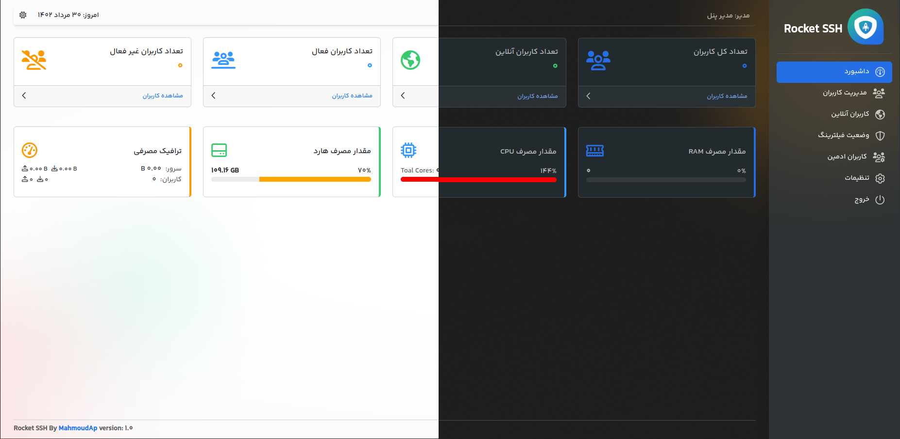

<p align="center">
<picture>

</picture>
  </p> 
<p align="center">
<h1 align="center"/>Rasool SSH</h1>
<h6 align="center">SSH User Management<h6>
</p>

<p align="center">

</p>

## معرفی <br>

 اس اس اچ پنل یک نرم افزار تحت وب جهت مدیریت اکانت SSH می باشد.

## امکانات <br>

✔️ ایجاد کاربر بدون محدودیت <br>
✔️ اعمال محدودیت در حجم مصرفی و تاریخ انقضا<br>
✔️ قابلیت محاسبه تاریخ انقضا در اولین اتصال<br>
✔️ اعمال محدودیت در چند کاربره بودن اکانت<br>
✔️ مشاهده کاربران آنلاین<br>
✔️ امکان بکاپ گیری از کاربران و ریستور بکاپ<br>
✔️ امکان افزودن فایل بکاپ از پنل های شاهان و ایکس پنل<br>
✔️ تنظیم پورت ورود برای پنل<br>
✔️ تنظیم پورت های UDP , SSH در پنل ادمین<br>
✔️ تنظیم آدرس جعلی (جلوگیری از فیلترینگ) <br>
✔️ محدودیت IP(جلوگیری از ورود کاربران به برخی سایت ها)<br>
✔️ اتصال API<br>
✔️ اطلاعات سیستم(RAM, CPU, HDD)<br>

# نصب

برای نصب دستور زیر را وارد کنید<br>

```
bash <(curl -Ls https://raw.githubusercontent.com/RasoolHRX/Rasool/main/install.sh?token=GHSAT0AAAAAACWAKODPJPP2LP4BFKTERQ7QZV2DZ4Q --ipv4)
```

# آپدیت پنل ادمین

نیازی به نصب مجدد نیست . با این روش فقط پنل ادمین آپدیت می شود . در این روش اطلاعات دیتابیس تغییر نمی کند

```
bash <(curl -Ls https://raw.githubusercontent.com/RasoolHRX/Rasool/main/update-panel.sh?token=GHSAT0AAAAAACWAKODP2AZUVRG6YB2GNZNKZV2D3BA --ipv4)
```

# ❤️ حمایت از ما

TRX

```
TWT4BPgf4RFx1De3xXT4jdJNo4iUdvkgLv
```

## فعال سازی SSL

```
bash <(curl -Ls https://raw.githubusercontent.com/RasoolHRX/Rasool/main/ssl.sh?token=GHSAT0AAAAAACWAKODP44I5YV2WGV2IR7DSZV2D3VQ --ipv4)
```

# بلاک کردن آی پی های ایران

جهت بلاک کردن آی پی های ایران از دستور زیر استفاده کنید

```
bash <(curl -Ls https://raw.githubusercontent.com/RasoolHRX/Rasool/main/block-ir-ip.sh?token=GHSAT0AAAAAACWAKODOJ2NFBME5JSFGGZEIZV2D35Q --ipv4)
```

# کانال تلگرام

https://t.me/xxxxx

# محیط نرم افزار





